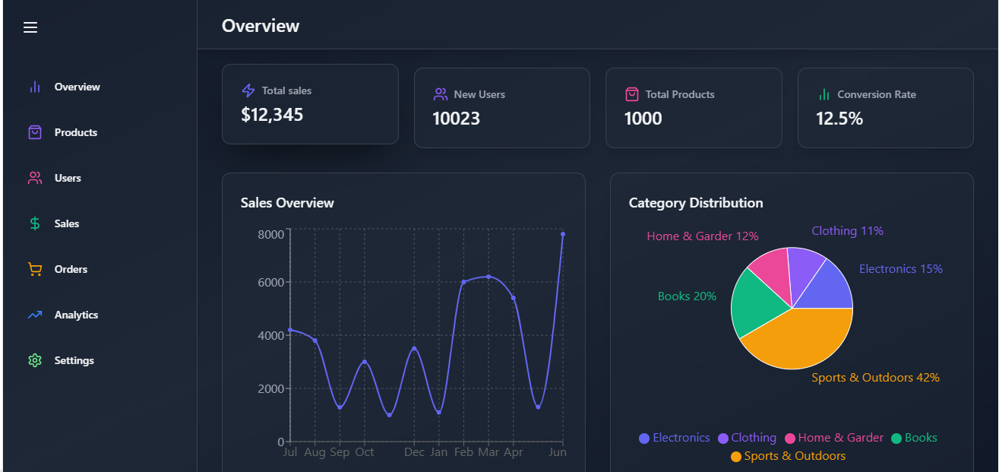
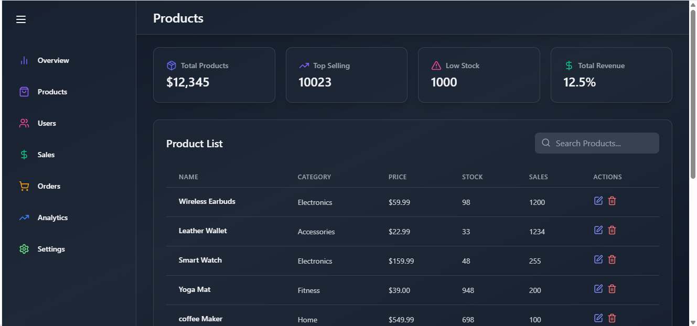
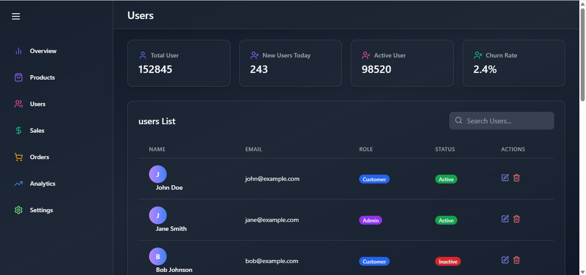
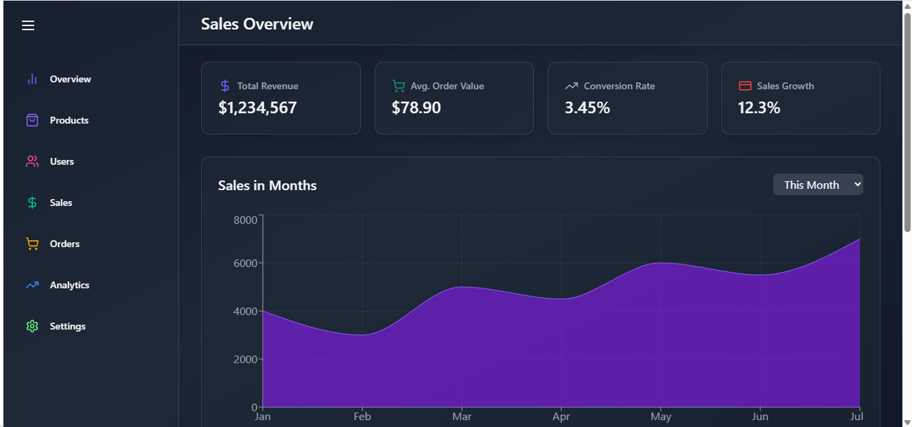
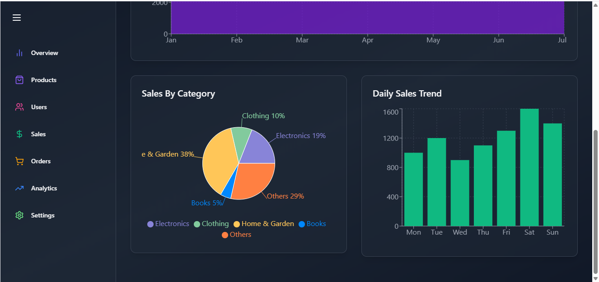
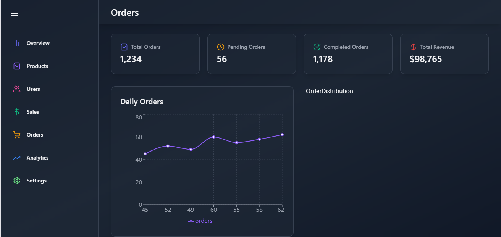

# Admin Dashboard UI

## *Introduction*

- Aim of creating admin panel Ui to build confidence in me.
- facing new challenges in UI Designing while creating and learning new tech stack like chart.js library, and simple css animation.
- Admin panel is based on product sales and profit counts.
- ## ***Components***
1. ### Overview

    
---
2. ### Products
    
---
3. ### Users
    
---
4. ### Sales
    
     
---
5. ### Orders
     
---

note: analytics and setting is not done yet. i will update these as soon as possible.

Thanks for visiting and reviewing 😊.
